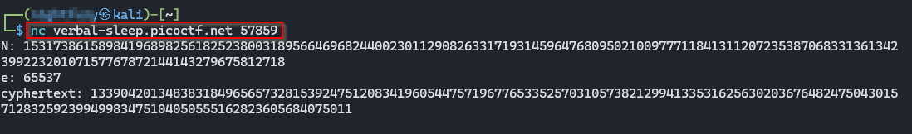
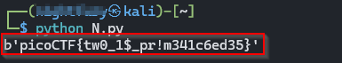

# RSA Weak Key Exploitation Write-Up (picoCTF)


**Challenge name:** EVEN RSA CAN BE BROKEN

**Category:** Cryptography

**Difficulty:** Easy

**Author:** NIGHTFURY0X01 (Arash)

---

This challenge provides the following RSA parameters:
```
    N = 24224520610277575589851733392636641315989297600644530610716243743137846551726954518127331546782176423087597699515269761166418260141894561942456218320624406
    e = 65537
    ciphertext = 13502684322297073339651917584538174998966228696478810195716408040047666074026984493091612665239657109218903914577974169613998807911064891506392405157028747
```


## 1. Observing the Weakness

The modulus **N** is supposed to be the product of two large primes
**p** and **q**.\
However, in this challenge, one of the prime factors is extremely small:

    p = 2

This makes the RSA system completely insecure.

We compute:

    q = N / p

Since **p = 2**, the factorization is trivial.

------------------------------------------------------------------------

## 2. Computing φ(N)

Euler's Totient for RSA:

    φ(N) = (p - 1)(q - 1)

Since **p = 2**, we have:

    φ(N) = 1 × (q - 1)
         = q - 1

------------------------------------------------------------------------

## 3. Computing the Private Exponent d

The private key exponent **d** is computed as the modular inverse of *e*
modulo φ(N):

    d = inverse(e mod φ(N))

In Python:

``` python
d = pow(e, -1, phi)
```

This gives us the private key.

------------------------------------------------------------------------

## 4. Decrypting the Ciphertext

RSA decryption:

    m = c^d mod N

Then convert the resulting integer into bytes:

``` python
plaintext = m.to_bytes((m.bit_length() + 7) // 8, 'big')
```

This reveals the flag in the form:

    picoCTF{...}

------------------------------------------------------------------------

## 5. Full Python Script

``` python
N = 24224520610277575589851733392636641315989297600644530610716243743137846551726954518127331546782176423087597699515269761166418260141894561942456218320624406
e = 65537
c = 13502684322297073339651917584538174998966228696478810195716408040047666074026984493091612665239657109218903914577974169613998807911064891506392405157028747

p = 2
q = N // p
phi = q - 1

d = pow(e, -1, phi)

m = pow(c, d, N)

plaintext = m.to_bytes((m.bit_length() + 7) // 8, 'big')
print(plaintext)
```


------------------------------------------------------------------------

## 6. Conclusion

This challenge demonstrates how **RSA completely collapses when one of
the primes is too small**.

The entire attack is possible because:

-   Factoring N becomes trivial.
-   The private key can be computed.
-   The ciphertext can be decrypted.

This is why **RSA must always use two large primes**, typically at least
**2048 bits**.
