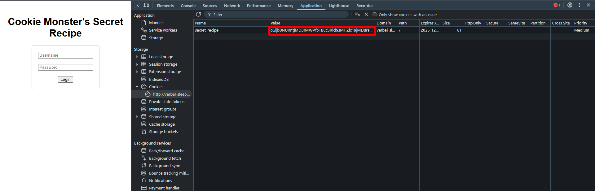
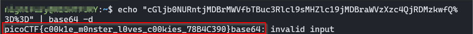

>> Writeup — Cookie Monster Secret Recipe

**Challenge:** Cookie Monster Secret Recipe 

**Category:** Web Exploitation 

**Author:** NIGHTFURY0X01 (Arash)  

**Level:** Easy

---

### Challenge Summary

Cookie Monster hides his secret cookie recipe inside a cookie value on his website. By inspecting the browser’s developer tools, we can extract and decode the hidden data to reveal the flag.

---

### Step-by-Step Solution

#### **1. Open Developer Tools**
Press **F12** in your browser to open the developer tools.

#### **2. Locate the Cookie**
Go to:

**Application → Storage → Cookies**

Find the cookie used by the website and copy its **Value** field.

For this challenge, the cookie value was:



```bash
Gljb0NURntjMDBrMWVfbTBuc3Rlcl9sMHZlc19jMDBraWVzXzc4QjRDMzkwfQ%3D%3D
```

This value is URL-encoded Base64.

---

### **3. Decode the Cookie**

First, decode URL encoding (the browser usually does this automatically).  
Then decode the Base64:

```bash
echo "cGljb0NURntjMDBrMWVfbTBuc3Rlcl9sMHZlc19jMDBraWVzXzc4QjRDMzkwfQ==" | base64 -d
```



## This outputs:
```
picoCTF{c00k1e_m0nster_l0ves_c00kies_78B4C390}
```