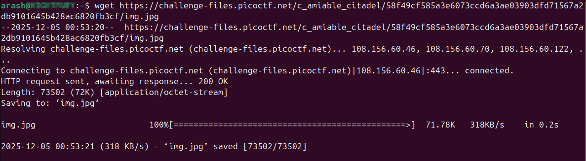
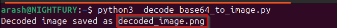
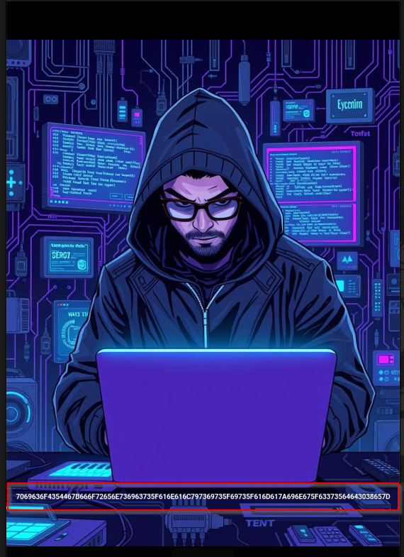
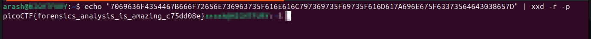

# Writeup - Hidden in plainsight

**Challenge:** Hidden in plainsight
**Category:** Forensics
**Author:** NIGHTFURY0X01 (Arash)
**Level:** Easy

------------------------------------------------------------------------

## Description

The SOC team found an extremely large log file that turned out to
contain Base64‑encoded data.\
After downloading and decoding it, the result formed an image.\
That image contained a hidden hexadecimal string, which when decoded
revealed the final flag.

------------------------------------------------------------------------

## Steps

### **1. Download the encoded file**

``` bash
wget <CHALLENGE_FILE_URL> 
```




Replace `<CHALLENGE_FILE_URL>` with the provided link.

------------------------------------------------------------------------

### **2. Decode the Base64 using Python**

Save the following Python script as `decode_base64_to_image.py`:

``` python
import base64

# Input and output files
input_file = "logs.txt"    # your encoded data
output_file = "decoded_image.png"  # output image file

# Read the Base64 content
with open(input_file, "r") as f:
    encoded_data = f.read()

# Remove whitespace/newlines if present
encoded_data = "".join(encoded_data.split())

# Decode Base64
image_data = base64.b64decode(encoded_data)

# Write to file
with open(output_file, "wb") as f:
    f.write(image_data)

print(f"Decoded image saved as {output_file}")


```

Run it:

``` bash
python3 decode_base64_to_image.py
```

This creates:

    decoded_image.png



------------------------------------------------------------------------

### **3. Extract the hex string from the image**

Open the image `decoded_image.png` manually and copy the visible hexadecimal sequence.




Example extracted hex:

    7069636F4354467B666F72656E736963735F616E616C797369735F69735F616D617A696E675F63373564643038657D

------------------------------------------------------------------------

### **4. Decode the hex string to obtain the flag**

``` bash
echo "7069636F4354467B666F72656E736963735F616E616C797369735F69735F616D617A696E675F63373564643038657D" | xxd -r -p
```



Output:

   picoCTF{forensics_analysis_is_amazing_c75dd08e}

------------------------------------------------------------------------

## Final Flag

   picoCTF{forensics_analysis_is_amazing_c75dd08e}
