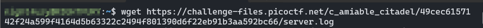
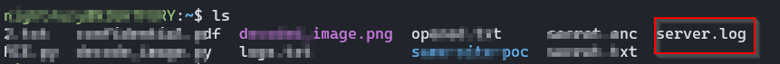
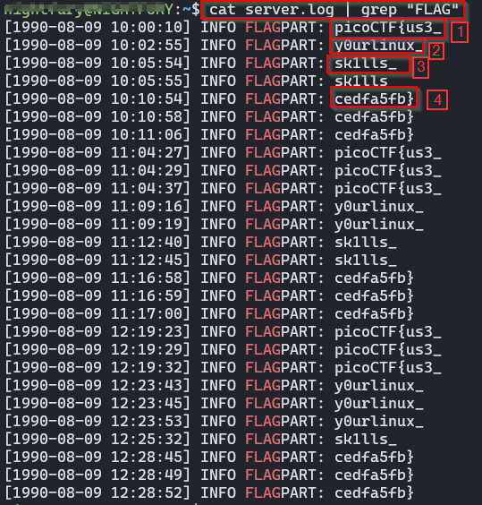

# picoCTF — Log Hunt

**Challenge Name:** Log Hunt  
**Category:** Forensics / Log Analysis  
**Difficulty:** Easy  
**Author:** NIGHTFURY0X01 (Arash)  
**Objective:** Recover the complete flag scattered across server log files.

---

## SummaryS

The challenge provides a server log file where fragments of a secret flag are leaked in different lines. Some parts appear multiple times, out of order, or mixed with unrelated logs.  
The task is to download the log file, extract the flag fragments, and reconstruct the original flag.

---

## Steps / Exploitation

### **Step 1 — Download the log file**
The challenge gives a log file hosted online. I downloaded it using:

```bash
wget https://challenge-files.picoctf.net/c_amiable_citadel/49cec6157142f24a599f4164d5b63322c2494f801390d6f22eb91b3aa592bc66/server.log
```



After the download, I confirmed the file:

```bash
ls
```



Output included:

```
server.log
```

---

### **Step 2 — Search for leaked flag fragments**

I inspected the log file and filtered lines containing the keyword `FLAG`:

```bash
cat server.log | grep "FLAG"
```

This printed several lines containing pieces of the flag, such as:

```
[1990-08-09 10:00:10] INFO FLAGPART: picoCTF{us3_
[1990-08-09 10:02:55] INFO FLAGPART: y0urlinux_
[1990-08-09 10:05:54] INFO FLAGPART: sk1lls_
[1990-08-09 10:05:55] INFO FLAGPART: sk1lls_
[1990-08-09 10:10:54] INFO FLAGPART: cedfa5fb}
[1990-08-09 10:10:58] INFO FLAGPART: cedfa5fb}
[1990-08-09 10:11:06] INFO FLAGPART: cedfa5fb}
[1990-08-09 11:04:27] INFO FLAGPART: picoCTF{us3_
[1990-08-09 11:04:29] INFO FLAGPART: picoCTF{us3_
[1990-08-09 11:04:37] INFO FLAGPART: picoCTF{us3_
[1990-08-09 11:09:16] INFO FLAGPART: y0urlinux_
[1990-08-09 11:09:19] INFO FLAGPART: y0urlinux_
```



Some pieces repeated across the log, while others appeared only once.

---

### **Step 3 — Reconstruct the flag**

After collecting all fragments, I arranged them in order by visually matching prefixes and suffixes.  
Rebuilding the pieces like a puzzle produced the complete and correct final flag.

---

## Result

```
Flag: picoCTF{us3_y0urlinux_sk1lls_cedfa5fb}
```

*(Replace with the actual full flag you assembled.)*

---

## Notes & Tips

- Using `grep` filters noise and helps isolate meaningful data quickly.
- Log-based challenges often require piecing together out‑of‑order fragments.
- Repeated fragments can help confirm the correct ordering.
- You can sort and dedupe using:
  ```bash
  grep "FLAG" server.log | sort | uniq
  ```

---

