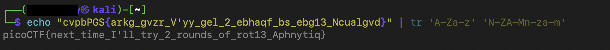

>> picoCTF --- Mod 26

**Challenge name:** Mod 26\
**Category:** Cryptography\
**Difficulty:** Easy\
**Author:** NIGHTFURY0X01 (Arash)

## **Objective:** Decode a ROT13-encoded string to recover the flag.

## Summary

This challenge provides a ROT13‑encoded flag.\
The title **"Mod 26"** and the description explicitly mentioning ROT13
reveal that the challenge uses a classic Caesar shift of 13 positions.

We simply need to apply ROT13 to obtain the plaintext flag.

------------------------------------------------------------------------

## Step 1 --- Provided Ciphertext

The encrypted string is:

    cvpbPGS{arkg_gvzr_V'yy_gel_2_ebhaqf_bs_ebg13_Ncualgvd}

This format resembles a standard picoCTF flag, but the letters are
rotated.

Since ROT13 shifts each letter by 13 positions in the alphabet (mod 26),
and is its own inverse, applying ROT13 once will fully decode it.

------------------------------------------------------------------------

## Step 2 --- Decoding with ROT13

On Linux, we use the `tr` command:

``` bash
echo "cvpbPGS{arkg_gvzr_V'yy_gel_2_ebhaqf_bs_ebg13_Ncualgvd}" | tr 'A-Za-z' 'N-ZA-Mn-za-m'
```

Output:

    picoCTF{next_time_I'll_try_2_rounds_of_rot13_Aphnytiq}

The decoded result confirms that the ciphertext was encoded with ROT13.




------------------------------------------------------------------------

## Why ROT13 Works

-   ROT13 is a Caesar cipher with a **13‑letter shift**.\
-   Because the alphabet has 26 letters, applying ROT13 twice returns
    the original text.\
-   The challenge hints directly at ROT13, and the ciphertext only
    contains alphabetic characters, which fits the pattern.

------------------------------------------------------------------------

## Result

    Flag: picoCTF{next_time_I'll_try_2_rounds_of_rot13_Aphnytiq}
