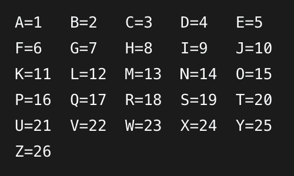

>> The Numbers - Writeup

**Challenge Name:** The Numbers

**Category:** Cryptography  

**Difficulty:** Easy

**Author:** NIGHTFURY0X01 (Arash)  

---

## Challenge Overview
We are given an image file called `numbers.png` which contains a sequence of numbers in a specific format. The challenge description hints at the famous quote from Call of Duty: "The numbers... what do they mean?" which suggests we're dealing with a number-to-letter cipher.


## Solution

### Step 1: Analyzing the Numbers
The numbers are presented in this format:
```bash
16 9 3 15 3 20 6 {20 8 5 14 21 13 2 5 18 19 13 1 19 15 14}

```


This looks like a typical flag format where:
- The first part before the curly braces represents the flag wrapper (usually something like "PICOCTF")
- The part inside the curly braces is the actual flag content

### Step 2: Recognizing the Cipher
This is a classic **A1Z26 cipher**, where each number corresponds to a letter in the alphabet:
- A = 1
- B = 2
- C = 3
- ...
- Z = 26




### Step 3: Manual Decryption

**First part (before curly braces):**
- 16 → P
- 9 → I
- 3 → C
- 15 → O
- 3 → C
- 20 → T
- 6 → F

Result: `PICOCTF`

**Inside the curly braces:**
- 20 → T
- 8 → H
- 5 → E
- 14 → N
- 21 → U
- 13 → M
- 2 → B
- 5 → E
- 18 → R
- 19 → S
- 13 → M
- 1 → A
- 19 → S
- 15 → O
- 14 → N

Result: `THENUMBERSMASON`

### Step 4: Using Tools for Verification
We can verify our solution using command-line tools:

**Using Python:**
```python
numbers = "16 9 3 15 3 20 6 {20 8 5 14 21 13 2 5 18 19 13 1 19 15 14}"
result = ""
for part in numbers.split():
    if part.isdigit():
        result += chr(int(part) + 64)  # A=65 in ASCII, 65-1=64
    else:
        result += part
print(result)
``` 

## Using ROT13/tr (for the cultural reference):
The decoded phrase "THENUMBERSMASON" is a reference to the Call of Duty meme "The numbers, Mason! What do they mean?"

## Step 5: Alternative Solving Methods
Since this is from picoCTF, we could also use:

+ CyberChef with the "From Charcode" operation

+ Online A1Z26 decoders

+ Manual mapping using an alphabet chart

## Flag:

```
picoCTF{THENUMBERSMASON}
```
---

## Learning Points

+ A1Z26 cipher is a simple substitution cipher where numbers represent alphabet positions

+ CTF flag formats often follow patterns like `PICOCTF{...}`

+ Cultural references in CTF challenges can provide hints about the solution

+ Basic cryptography skills including number-to-letter substitution

## Tools Used

+ Basic text editor

+ Python interpreter

+ Logical deduction


