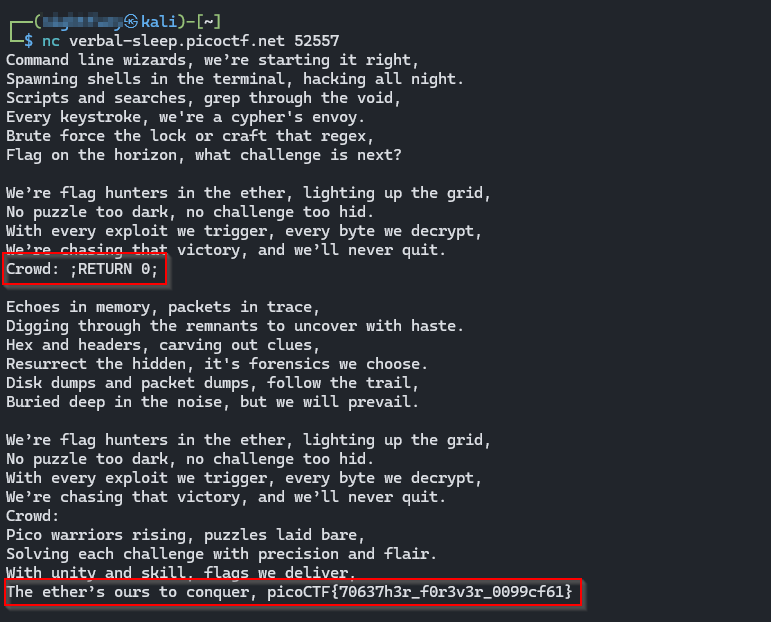

>> Writeup — Flag Hunters 

**Challenge:**  Flag Hunters

**Category:** Reverse Engineering 

**Author:** NIGHTFURY0X01 (Arash)

**Level:** Easy

---

### Challenge summary

+ The service prints song lyrics that can jump between verses and a refrain. There is a hidden refrain (containing the flag) that the program never prints by default. By interacting with the program you can manipulate its control flow and force it to print that hidden refrain.

+ Vulnerability (one‑line)

The program accepts unvalidated user input for a `CROWD` placeholder and writes that input back into the lyric lines. Later the program `split(';')`s each line and treats pieces like commands (`RETURN N`, `REFRAIN`, `END`) — so a user can inject `;RETURN 0;` (or similar) to insert a control command and jump to line 0, which contains the hidden refrain (and thus the flag).

### Why this works (concise)

+ The program stores the song in a list of lines.

+ When it sees a `CROWD` marker, it does `song_lines[lip] = 'Crowd: ' + (user input)`.

+ Later the same `song_lines[lip]` is processed with `song_lines[lip].split(';')` and each piece is interpreted.

+ By including `;RETURN 0;` in the crowd input, the injected `RETURN 0` piece is executed, setting the line pointer to 0. Line 0 is `secret_intro` which contains the flag, so it gets printed.

```python
import re
import time


# Read in flag from file
flag = open('flag.txt', 'r').read()

secret_intro = \
'''Pico warriors rising, puzzles laid bare,
Solving each challenge with precision and flair.
With unity and skill, flags we deliver,
The ether’s ours to conquer, '''\
+ flag + '\n'


song_flag_hunters = secret_intro +\
'''

[REFRAIN]
We’re flag hunters in the ether, lighting up the grid,
No puzzle too dark, no challenge too hid.
With every exploit we trigger, every byte we decrypt,
We’re chasing that victory, and we’ll never quit.
CROWD (Singalong here!);
RETURN

[VERSE1]
Command line wizards, we’re starting it right,
Spawning shells in the terminal, hacking all night.
Scripts and searches, grep through the void,
Every keystroke, we're a cypher's envoy.
Brute force the lock or craft that regex,
Flag on the horizon, what challenge is next?

REFRAIN;

Echoes in memory, packets in trace,
Digging through the remnants to uncover with haste.
Hex and headers, carving out clues,
Resurrect the hidden, it's forensics we choose.
Disk dumps and packet dumps, follow the trail,
Buried deep in the noise, but we will prevail.

REFRAIN;

Binary sorcerers, let’s tear it apart,
Disassemble the code to reveal the dark heart.
From opcode to logic, tracing each line,
Emulate and break it, this key will be mine.
Debugging the maze, and I see through the deceit,
Patch it up right, and watch the lock release.

REFRAIN;

Ciphertext tumbling, breaking the spin,
Feistel or AES, we’re destined to win.
Frequency, padding, primes on the run,
Vigenère, RSA, cracking them for fun.
Shift the letters, matrices fall,
Decrypt that flag and hear the ether call.

REFRAIN;

SQL injection, XSS flow,
Map the backend out, let the database show.
Inspecting each cookie, fiddler in the fight,
Capturing requests, push the payload just right.
HTML's secrets, backdoors unlocked,
In the world wide labyrinth, we’re never lost.

REFRAIN;

Stack's overflowing, breaking the chain,
ROP gadget wizardry, ride it to fame.
Heap spray in silence, memory's plight,
Race the condition, crash it just right.
Shellcode ready, smashing the frame,
Control the instruction, flags call my name.

REFRAIN;

END;
'''

MAX_LINES = 100

def reader(song, startLabel):
  lip = 0
  start = 0
  refrain = 0
  refrain_return = 0
  finished = False

  # Get list of lyric lines
  song_lines = song.splitlines()

  # Find startLabel, refrain and refrain return
  for i in range(0, len(song_lines)):
    if song_lines[i] == startLabel:
      start = i + 1
    elif song_lines[i] == '[REFRAIN]':
      refrain = i + 1
    elif song_lines[i] == 'RETURN':
      refrain_return = i

  # Print lyrics
  line_count = 0
  lip = start
  while not finished and line_count < MAX_LINES:
    line_count += 1
    for line in song_lines[lip].split(';'):
      if line == '' and song_lines[lip] != '':
        continue
      if line == 'REFRAIN':
        song_lines[refrain_return] = 'RETURN ' + str(lip + 1)
        lip = refrain
      elif re.match(r"CROWD.*", line):
        crowd = input('Crowd: ')
        song_lines[lip] = 'Crowd: ' + crowd
        lip += 1
      elif re.match(r"RETURN [0-9]+", line):
        lip = int(line.split()[1])
      elif line == 'END':
        finished = True
      else:
        print(line, flush=True)
        time.sleep(0.5)
        lip += 1


reader(song_flag_hunters, '[VERSE1]')

```

---

### Exploitation steps (manual)

+ Connect to the service:
```bash
$ nc verbal-sleep.picoctf.net <picoCTF> #Example :52557
```

+ Wait until the program prints a `Crowd:` prompt (it will reach that as it plays the song).

+ At the `Crowd:` prompt, type:

```bash
;RETURN 0;
```

+ and press Enter.

### The program will handle the injected `RETURN 0` and jump to the hidden refrain (line 0) — the `secret_intro `will be printed and the flag revealed.

### Example interactive session (mock)
```bash
$ nc verbal-sleep.picoctf.net 52557
Command line wizards, we’re starting it right,
Spawning shells in the terminal, hacking all night.
Scripts and searches, grep through the void,
Every keystroke, we're a cypher's envoy.
Brute force the lock or craft that regex,
Flag on the horizon, what challenge is next?

We’re flag hunters in the ether, lighting up the grid,
No puzzle too dark, no challenge too hid.
With every exploit we trigger, every byte we decrypt,
We’re chasing that victory, and we’ll never quit.
Crowd: ;RETURN 0;

Echoes in memory, packets in trace,
Digging through the remnants to uncover with haste.
Hex and headers, carving out clues,
Resurrect the hidden, it's forensics we choose.
Disk dumps and packet dumps, follow the trail,
Buried deep in the noise, but we will prevail.

We’re flag hunters in the ether, lighting up the grid,
No puzzle too dark, no challenge too hid.
With every exploit we trigger, every byte we decrypt,
We’re chasing that victory, and we’ll never quit.
Crowd:
Pico warriors rising, puzzles laid bare,
Solving each challenge with precision and flair.
With unity and skill, flags we deliver,
The ether’s ours to conquer, picoCTF{70637h3r_f0r3v3r_0099cf61}
```




