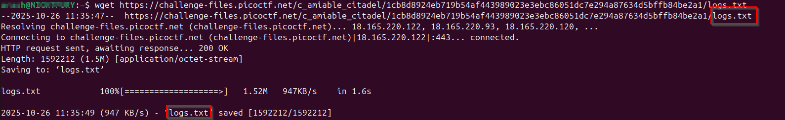
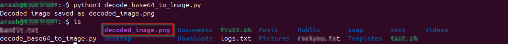
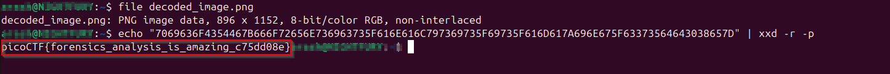

>> Write-up — Extracting the hidden flag from the encoded logs

**Challenge:** Flag in Flame

**Category:** Forensics

**Author:** NIGHTFURY0X01 (Arash)

**Level:** Easy

+ Goal: download the encoded data, turn it into an image file, extract the hidden code from the image, and decode the code to reveal the flag. This write-up shows exact commands and two small Python scripts you can run on Linux.

## Note: replace URL_OF_LOGS_DATA with the real URL you were given.

### Step 1 — Download the encoded file

Use wget to fetch the provided logs file:




+ This prints the file size and the first few lines so you can see whether the file contains base64-looking text (A-Za-z0-9+/=), hex (0-9a-f), or something else.

### Step 2 — Decode the encoded file to create an image

## Two common cases:

+ The file holds Base64 image bytes → decode to produce an image file.

+ The file holds hex that represents binary image bytes → convert hex to binary.

+ Below are two small Python scripts. Use the one that matches what you observed in head -n 3 logs_data.txt.

## file is Base64 (typical large blocks of A-Za-z0-9+/=)

+ Create decode_base64_to_image.py:
```python
import base64

# Input and output files
input_file = "logs_data.txt"    # your encoded data
output_file = "decoded_image.png"  # output image file

# Read the Base64 content
with open(input_file, "r") as f:
    encoded_data = f.read()

# Remove whitespace/newlines if present
encoded_data = "".join(encoded_data.split())

# Decode Base64
image_data = base64.b64decode(encoded_data)

# Write to file
with open(output_file, "wb") as f:
    f.write(image_data)

print(f"Decoded image saved as {output_file}")

```
### Run it:

```bash
python3 decode_base64_to_image.py
file decoded_image.png
```


## Step 3 — Inspect the produced image

+ Open image :


## Step 4 — decode the code : 

```bash

echo "7069636F4354467B666F72656E736963735F616E616C797369735F69735F616D617A696E675F63373564643038657D" | xxd -r -p
```




