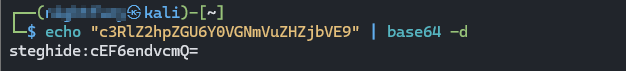
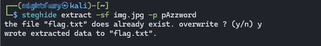

>> Hidden in plainsight — Writeup

**Challenge:** Hidden in plainsight

**Category:** Forensics

**Author:** NIGHTFURY0X01 (Arash)

**Level:** Easy

---

## Summary

A seemingly ordinary 640×640 JPEG contained a small hidden file inside its data. The image's EXIF `Comment` field contained a Base64-encoded hint which, after double-decoding, revealed the Steghide passphrase `pAzzword`. Using that passphrase with `steghide` allowed extraction of a compressed and AES-encrypted `flag.txt` (34 bytes) which contained the flag.

---

## Tools used

* `wget` — download the image
* `exiftool` — inspect metadata
* `base64` — decode Base64-encoded hints
* `steghide` — extract the embedded file
* `cat` — read the flag

---

## Step-by-step solve

1. **Download the image**

```bash
wget <link> 
```

2. **Inspect metadata with `exiftool`**

Run:

```bash
exiftool img.jpg
```


You should notice a suspicious `Comment` field, for example:

```
Comment                         : c3RlZ2hpZGU6Y0VGNmVuZHZjbVE9
```

3. **Decode the Comment (Base64)**

The `Comment` value is Base64. Decode it:

```bash
echo "c3RlZ2hpZGU6Y0VGNmVuZHZjbVE9" | base64 -d
# output: steghide:cEF6endvcmQ=
```




The decoded text is `steghide:cEF6endvcmQ=` — it hints at `steghide` and contains another Base64 string.

4. **Decode the inner Base64 (the passphrase)**

Decode the second part:

```bash
echo "cEF6endvcmQ=" | base64 -d
# output: pAzzword
```


The passphrase for `steghide` is `pAzzword`.

> Tip: use `echo -n` if you want to avoid adding a trailing newline when decoding.

5. **Extract the embedded file using `steghide`**

```bash
steghide extract -sf img.jpg -p pAzzword
```



You should see:

```
wrote extracted data to "flag.txt".
```

`steghide` automatically handles the compression and AES (rijndael-128 CBC) decryption when the correct passphrase is provided.

6. **Read the flag**

```bash
cat flag.txt
```

This prints the challenge flag (e.g., `FLAG{...}`).
```
picoCTF{h1dd3n_1n_1m4g3_871ba555}
```
---

## Compact command summary

```bash
wget <link> -O img.jpg
exiftool img.jpg
# decode the hint
echo "c3RlZ2hpZGU6Y0VGNmVuZHZjbVE9" | base64 -d
echo "cEF6endvcmQ=" | base64 -d        # gives pAzzword
# extract embedded file
steghide extract -sf img.jpg -p pAzzword
# read flag
cat flag.txt
```

---

## Notes / Troubleshooting

* If `steghide` reports a *wrong passphrase*, re-check for trailing whitespace/newlines when decoding. Use `echo -n` to avoid adding a newline:

```bash
echo -n "cEF6endvcmQ=" | base64 -d
```

* If `steghide` isn't installed, on Debian/Ubuntu:

```bash
sudo apt update && sudo apt install steghide
```

* If the image was corrupted during download, re-download and verify file size or checksum.

---

## Why this worked

* The EXIF metadata (`Comment`) contained a Base64-encoded hint pointing to `steghide` and the passphrase. Hiding hints in metadata is a common CTF steganography trick.
* The passphrase being double-encoded (Base64 inside Base64) added a small extra step.
* `steghide` supports embedded file compression and AES encryption (rijndael-128 in CBC mode), and will decompress/decrypt automatically if supplied the correct passphrase.


