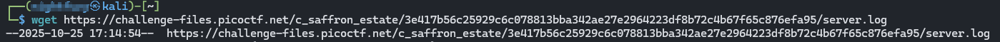
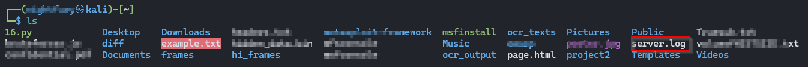
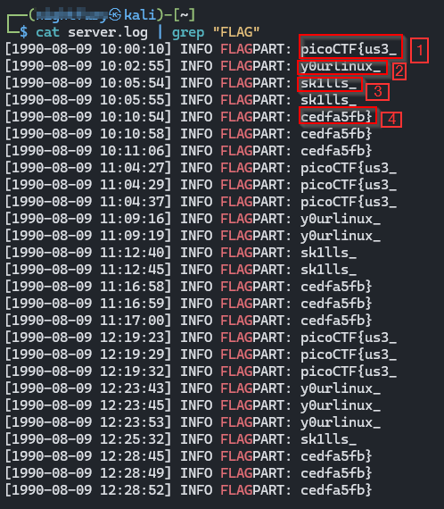

>> picoCTF — Log Hunt (Writeup)

. Challenge: Pieces of a secret flag are leaking in server logs. Reconstruct the full flag from the scattered fragments.

. Category: Forensics / Logs

. Level : Easy

. Author: NIGHTFURY0X01 (Arash)

+ Summary

The server log contained many small fragments of the flag labeled FLAGPART. By extracting those lines, ordering them by timestamp, removing duplicates, and concatenating the fragments, we recovered the full flag.

+ Tools

. wget — download the challenge log file

. ls, cat, grep, sort, awk standard shell tools for inspection and processing

+ Steps & Commands

1. Download the log file (example  you already did this)




2. Confirm the file exists




3. Extract only the lines that contain the flag fragments





4. (Optional) Extract only the fragment text and order by timestamp
This is robust if fragments are out of order or repeated:

```bash 
# Print timestamp and fragment, then sort by timestamp and print only the fragment (last field)
grep "FLAGPART" server.log | sort | awk -F'FLAGPART: ' '{print $2}'
```


+ That prints:
``` bash
picoCTF{us3_
y0urlinux_
sk1lls_
sk1lls_
cedfa5fb}
cedfa5fb}
 ```

5. Remove duplicates and concatenate fragments

.Visual inspection shows sk1lls_ and cedfa5fb} are repeated. We only need each fragment once in timestamp order.

.Concatenate unique fragments in their chronological order:

+ Fragments in order (unique):

```bash
picoCTF{us3_
y0urlinux_
sk1lls_
cedfa5fb}

```
+ Concatenate them:

```bash
picoCTF{us3_y0urlinux_sk1lls_cedfa5fb}
```

+ Final Flag
``` bash
picoCTF{us3_y0urlinux_sk1lls_cedfa5fb}
```

+ Notes & Tips

. Always order fragments by timestamp when logs are involved  timestamps indicate the correct sequence.

. Logs often contain repeated lines (retries, duplicates); deduplicate when assembling the final string.

. Useful one-liner to extract, deduplicate (while preserving first occurrence order), and concatenate in bash:
