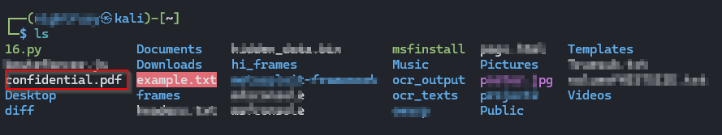
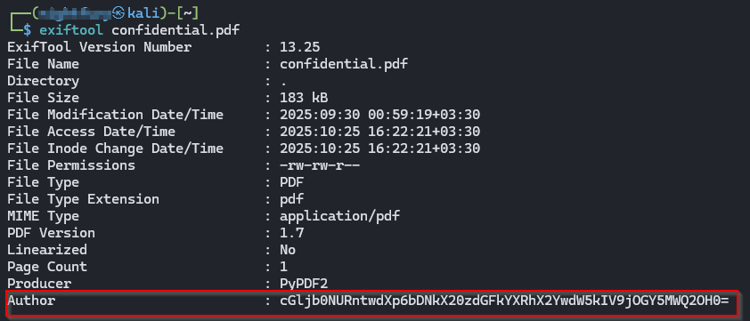
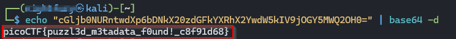

picoCTF — Riddle-Registry (PDF metadata) Writeup

Challenge: Hidden flag inside a PDF file's metadata
Category: Forensics / Steganography (metadata)
Level : Easy
Author: NIGHTFURY0X01(Arash)

+ Summary : 

The provided PDF looked like meaningless or garbled content, but the flag was hidden in the file's metadata. I used exiftool to inspect the PDF metadata, found a Base64-encoded string, decoded it, and recovered the flag.

+ Tools

. exiftool (read file metadata)

. base64 (decode Base64 strings)

. wget (download challenge file)

+ Steps & Commands

1. Install exiftool (if not already installed)


2. Download the challenge PDF


3. List files to confirm download




4. Inspect PDF metadata with exiftool




In the exiftool output you will see many metadata fields. One of the fields contained a Base64-encoded string similar to:

```bash 

cGljb0NURntwdXp6bDNkX20zdGFkYXRhX2YwdW5kIV9jOGY5MWQ2OH0=

```


5. Decode the Base64 string to reveal the flag




+ Notes & Tips

. exiftool shows XMP and PDF metadata fields where CTF authors often hide flags (Author, Keywords, Comments, custom XMP tags, etc.).

. If you find a suspicious string, check whether it's encoded (Base64, hex, etc.) and decode accordingly.

. When adding screenshots to your repo, sanitize any personal usernames or sensitive info (cover or blur them).

. Keep writeups concise and reproducible: include commands, sample outputs, and the final flag.

