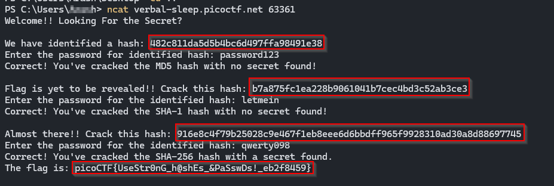
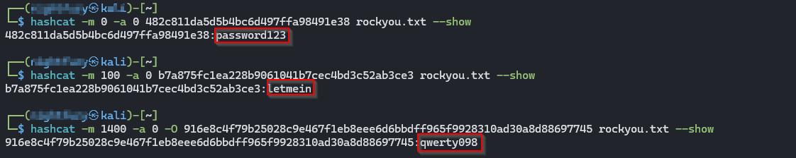

>> picoCTF — hashcrack 

**Challenge:** hashcrack   

**Category:** Cryptography

**Author:** NIGHTFURY0X01 (Arash)

**Level:** Easy

--- 

## Description
A company stored a secret message on a server which got breached because the admin used weakly hashed passwords. Your goal is to connect to the service, crack the provided hashes, and retrieve the secret (flag).

+ Connect to the challenge with:

```bash
nc verbal-sleep.picoctf.net <Random Port>
```



## During the interactive session the server presents three hashes to crack. Example session (answers shown below):

- MD5: `482c811da5d5b4bc6d497ffa98491e38` → `password123`  

- SHA-1: `b7a875fc1ea228b9061041b7cec4bd3c52ab3ce3` → `letmein`  

- SHA-256: `916e8c4f79b25028c9e467f1eb8eee6d6bbdff965f9928310ad30a8d88697745` → `qwerty098`

## Tools
- `hashcat` — fast hash cracking utility (CPU/GPU)

- `rockyou.txt` (or another wordlist) — dictionary for cracking

- `nc` / `ncat` — to connect to the remote service interactively

---

## Preparation (Ubuntu / Debian)

+ Install `hashcat`:
```bash
sudo apt update
sudo apt install -y hashcat
```
+ Download a wordlist (example):
```bash
wget https://github.com/brannondorsey/naive-hashcat/releases/download/data/rockyou.txt
# If you have a compressed rockyou.txt.gz:
# gunzip rockyou.txt.gz
```

## hashcat mode mapping (common modes used here):
```bash
| 32 chars | MD5 | `-m 0` |
| 40 chars | SHA1 | `-m 100` |
| 64 chars | SHA256 | `-m 1400` |
| 128 chars | SHA512 | `-m 1700` |
```

## Commands (copy-and-run) 
+ Crack the example hashes using the `rockyou.txt` wordlist.

```bash
# Crack MD5
1 => hashcat -m 0 -a 0 482c811da5d5b4bc6d497ffa98491e38 rockyou.txt --show

# Crack SHA-1
2 => hashcat -m 100 -a 0 b7a875fc1ea228b9061041b7cec4bd3c52ab3ce3 rockyou.txt --show

# Crack SHA-256 (use -O for optimized kernels if desired)
3 =>hashcat -m 1400 -a 0 -O 916e8c4f79b25028c9e467f1eb8eee6d6bbdff965f9928310ad30a8d88697745 rockyou.txt --show
```


## Final Flag :
```bash
Flag: picoCTF{UseStr0nG_h@shEs_&PaSswDs!_eb2f8459}
```

## Notes about `-O`: `-O` enables optimized kernels which may increase speed but impose some length/charset limitations. Omit `-O` if you suspect the hash requires longer candidate lengths or custom rules.

